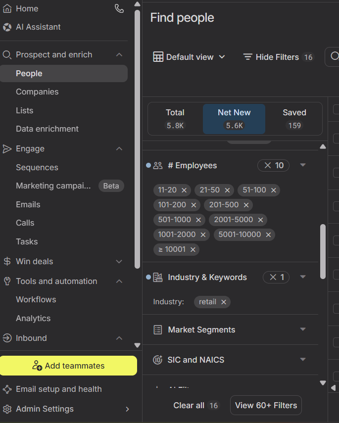
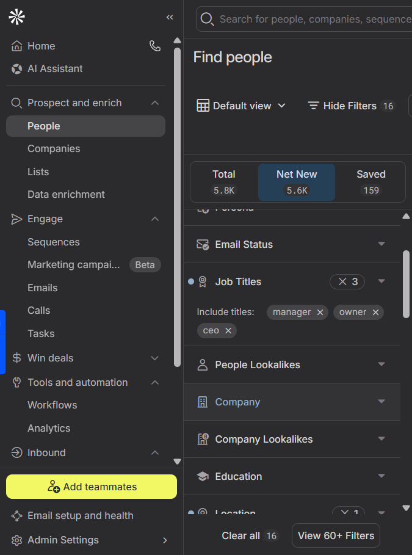
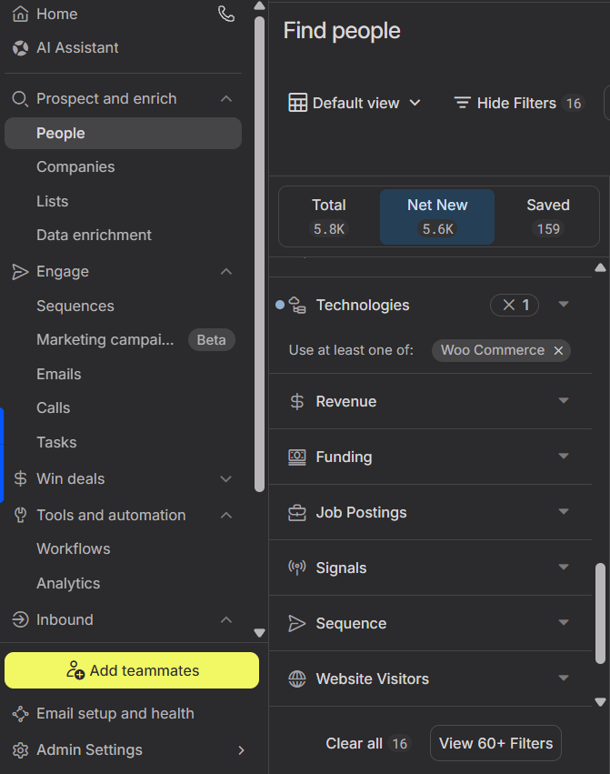

# 🚀 Lead Generation & Prospect Research

> Building a scalable B2B lead generation workflow using research, technology intelligence, and data validation.

---

# 📌 Project Overview

During my GTM internship, I worked on identifying high-quality B2B prospects for technology and eCommerce services. Instead of relying on mass prospecting, the workflow focused on identifying companies that matched predefined ICP criteria and collecting accurate business information for outreach.

The project combined market research, technology stack identification, account qualification, and decision-maker research to create GTM-ready prospect lists.

---

# 🎯 Objectives

- Build qualified prospect lists
- Research target companies
- Identify decision makers
- Validate company information
- Support outbound sales campaigns

---

# 🌍 Target Regions

- Canada
- Southeast Asia
- GCC
- North America

---

# 🏢 Target Industries

- Retail
- eCommerce
- Fashion
- Beauty
- Electronics
- Furniture
- Jewellery

---

# 🛠 Tools Used

| Tool | Purpose |
|------|---------|
| Apollo.io | Company & Contact Research |
| BuiltWith | Technology Detection |
| Wappalyzer | Website Technology Identification |
| LinkedIn | Decision Maker Research |
| Google Sheets | Lead Database |
| Google Search | Company Validation |

---

# 🔄 Lead Generation Workflow

```text
Define ICP
      │
      ▼
Research Target Companies
      │
      ▼
Identify Technology Stack
      │
      ▼
Qualify Company
      │
      ▼
Find Decision Makers
      │
      ▼
Validate Data
      │
      ▼
Export Lead List
```

---

# 📋 Qualification Criteria

- Industry alignment
- Company size
- Technology stack
- Geographic location
- Business model
- Website quality
- Active online presence

---

# 📊 Information Collected

- Company Name
- Website
- Country
- Industry
- Technology Stack
- Employee Count
- Revenue (where available)
- Decision Maker Name
- Job Title
- LinkedIn Profile
- Email Status

---

# 🎯 Deliverables

- Qualified company database
- Decision-maker contacts
- Technology stack analysis
- GTM-ready lead sheet
- Research documentation

---

# 💡 Key Skills Demonstrated

- Lead Generation
- Market Research
- ICP Qualification
- Account Research
- Technology Intelligence
- Sales Operations
- Data Validation
- CRM Data Preparation

---

# 📈 Impact

This workflow helped improve lead quality by focusing research on companies that matched the Ideal Customer Profile, reducing time spent on unqualified prospects and creating structured data ready for outbound sales campaigns.

---

# 🚀 Future Improvements

- AI-assisted company qualification
- Automated lead enrichment
- CRM integration
- Intent-data based prospecting
- Automated workflow using n8n

---

# 📸 GTM Prospecting Workflow (Apollo.io)

The following screenshots demonstrate the structured process used to identify and qualify target accounts.

## Step 1 – Company Qualification

Companies were filtered based on employee count and industry to align with the Ideal Customer Profile (ICP).



---

## Step 2 – Decision Maker Identification

Decision-makers such as CEOs, Owners, and Managers were identified to support targeted outreach.



---

## Step 3 – Technology Stack Qualification

Technology filters were applied to identify businesses using WooCommerce and other relevant eCommerce platforms.



---
