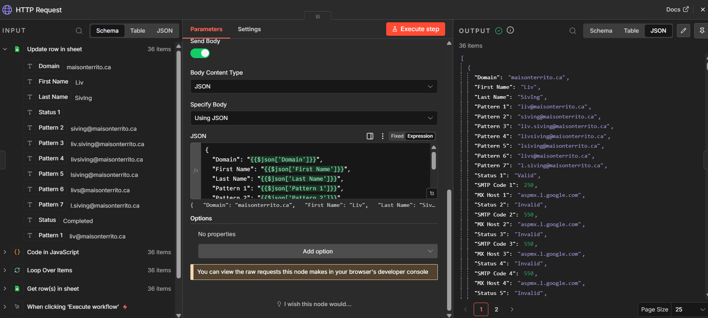
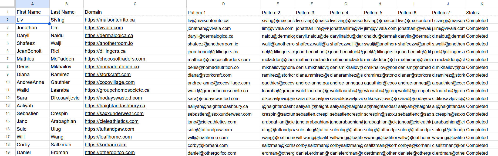
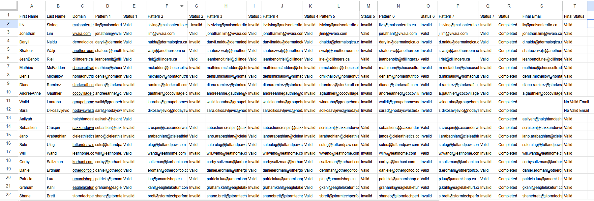

# 🤖 GTM Email Discovery & Validation Automation

> Automating business email generation and validation using n8n, HTTP APIs, and Google Sheets to accelerate GTM prospecting.

---

# 📌 Business Problem

Sales and GTM teams often know a prospect's name and company website but do not have a verified business email address.

Manually generating multiple email combinations and validating each one is time-consuming and inefficient.

This workflow automates email pattern generation, validates every possible email using an email verification API, and automatically identifies the first valid business email.

---

# 🎯 Objectives

- Automate email pattern generation
- Validate business email addresses
- Reduce manual prospect research
- Improve outbound data quality
- Build GTM-ready contact lists

---

# 🛠 Technologies Used

- n8n
- HTTP Request
- Google Sheets
- JSON
- Email Verification API
- JavaScript Expressions

---

# 🔄 Workflow

```text
Prospect Data
(First Name + Last Name + Domain)
                │
                ▼
Generate Email Patterns
                │
                ▼
HTTP Request
(Email Verification API)
                │
                ▼
Validate All Email Patterns
                │
                ▼
Select First Valid Email
                │
                ▼
Update Google Sheet
```

---

# 📸 Step 1 – n8n Workflow

The workflow receives prospect information from Google Sheets, sends multiple email combinations to an email verification API, and processes the response automatically.



---

# 📸 Step 2 – Email Pattern Generation

Possible business email formats are generated using the prospect's first name, last name, and company domain.

Examples include:

- firstname@company.com
- lastname@company.com
- firstname.lastname@company.com
- firstinitiallastname@company.com

The generated patterns are stored in Google Sheets for automated validation.



---

# 📸 Step 3 – Final Validation Results

After validating every email pattern, the workflow automatically selects the first valid email address and updates the spreadsheet with:

- Final Email
- Validation Status
- Completion Status



---

# 📊 Business Impact

This workflow helped:

- Reduce manual email research
- Improve lead data quality
- Increase outbound readiness
- Standardize email verification
- Automate repetitive GTM tasks

---

# 💡 Skills Demonstrated

- GTM Automation
- n8n Workflow Development
- HTTP API Integration
- Email Verification
- Google Sheets Automation
- JSON Processing
- Lead Enrichment
- Sales Operations

---

# 🚀 Future Improvements

- CRM Integration
- Apollo API Integration
- Bulk Lead Enrichment
- Automated Outreach Trigger
- AI-Based Lead Qualification
