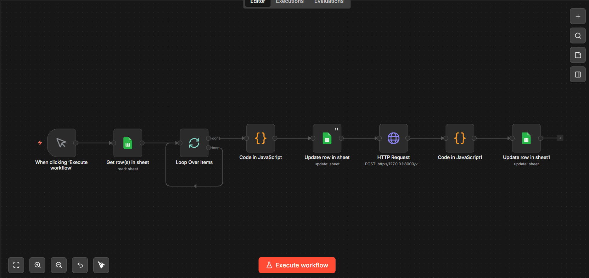

# 🤖 GTM Email Discovery & Validation Automation using n8n

> An automated workflow built with **n8n** to generate business email patterns, validate them using an email verification API, and update Google Sheets with verified contact information.

---

# 📌 Business Problem

Outbound sales teams often know a prospect's name and company website but do not have a verified business email address.

Manually generating multiple email combinations and checking every email through verification tools is repetitive, slow, and difficult to scale.

This workflow automates the entire process from email generation to verification, enabling faster GTM execution.

---

# 🎯 Objectives

- Automate business email generation
- Validate email addresses using an API
- Reduce manual prospect research
- Improve lead quality
- Build outreach-ready contact lists

---

# 🛠 Technologies Used

- n8n
- Google Sheets
- HTTP Request Node
- JSON
- Email Verification API
- Conditional Logic

---

# 🔄 Workflow

```text
Google Sheet
(First Name + Last Name + Domain)
                │
                ▼
Generate Email Patterns
                │
                ▼
HTTP Request
                │
                ▼
Email Verification API
                │
                ▼
Process API Response
                │
                ▼
Select Valid Email
                │
                ▼
Update Google Sheet
```

---

# 📸 Step 1 – n8n Workflow

The workflow orchestrates the complete automation process by reading prospect information, generating multiple email patterns, validating each address through an HTTP API, and returning the verified result.

> Upload your **actual workflow canvas** as:

```
assets/images/n8n-workflow.png
```

```markdown

```

---

# 📸 Step 2 – Email Pattern Generation

The workflow generates multiple business email combinations using the prospect's first name, last name, and company domain.

Examples include:

- firstname@company.com
- firstname.lastname@company.com
- flastname@company.com
- firstinitiallastname@company.com


---

# 📸 Step 3 – Final Validation Results

After validating all generated email combinations, the workflow automatically selects the first valid business email and updates Google Sheets.

Information updated includes:

- Final Email
- Email Status
- Validation Result


---

# 📊 Business Impact

This automation helps GTM teams by:

- Eliminating repetitive manual email verification
- Improving lead data accuracy
- Increasing outbound readiness
- Standardising contact enrichment
- Saving research time

---

# 💡 Skills Demonstrated

- GTM Automation
- n8n Workflow Development
- HTTP API Integration
- Email Verification
- Google Sheets Automation
- JSON Processing
- Lead Enrichment
- Workflow Automation

---

# 🚀 Future Improvements

- Apollo API Integration
- CRM Synchronisation
- Bulk Lead Enrichment
- AI-Based Lead Scoring
- Automated Email Outreach

---

## 🔗 Related Projects

- 🎯 [ICP Research](../01-ICP-Research)
- 🚀 [Lead Generation](../02-Lead-Generation)
- 🌐 [Website Technology Detector](../03-Website-Technology-Detector)

🏠 [Back to Portfolio Home](../)
